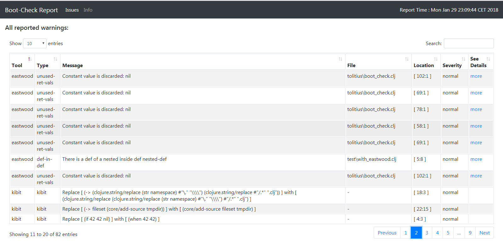
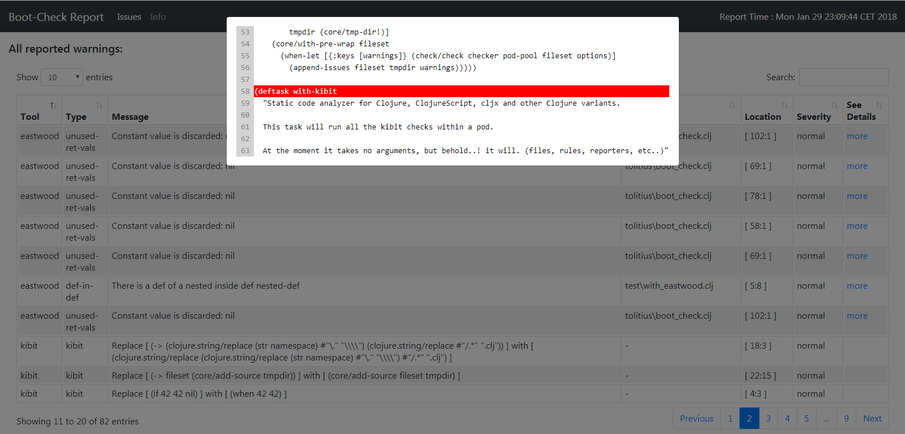

# boot-check

[Boot](https://github.com/boot-clj/boot) tasks to check, analyze and inspect Clojure/Script code.

It relies on universe tested [kibit](https://github.com/jonase/kibit),
[eastwood](https://github.com/jonase/eastwood), [yagni](https://github.com/venantius/yagni), [bikeshed](https://github.com/dakrone/lein-bikeshed) and other titans.

[](http://clojars.org/tolitius/boot-check)

- [Why](#why)
- [Kibit](#kibit)
  - [From Command Line](#from-command-line)
  - [From within "build.boot"](#from-within-buildboot)
  - [Help](#help)
- [Yagni](#yagni)
  - [From Command Line](#from-command-line-1)
  - [From within "build.boot"](#from-within-buildboot-1)
  - [Help](#help-1)
  - [Yagni entry points](#yagni-entry-points)
- [Eastwood](#eastwood)
  - [From Command Line](#from-command-line-2)
  - [From within "build.boot"](#from-within-buildboot-2)
  - [Help](#help-2)
- [Bikeshed](#bikeshed)
  - [From Command Line](#from-command-line-2)
  - [From within "build.boot"](#from-within-buildboot-2)
  - [Help](#help-2)
  - [Bikeshed options](#bikeshed-options)
- [Handling Errors](#handling-errors)
  - [Kibit Exceptions](#kibit-exceptions)
  - [Yagni Exceptions](#yagni-exceptions)
  - [Eastwood Exceptions](#eastwood-exceptions)
  - [Bikeshed Exceptions](#bikeshed-exceptions)
  - [Aggregating Errors](#aggregating-errors)
- [Reporting](#reporting)  
- [Demo](#demo)
- [License](#license)

## Why

To be able to reach out to multiple code analyzers as well as compose them as [Boot tasks](https://github.com/boot-clj/boot/wiki/Tasks):

```clojure
(require '[tolitius.boot-check :as check])
```

```clojure
(deftask check-sources []
  (set-env! :source-paths #{"src" "test"})
  (comp
    (check/with-yagni)
    (check/with-eastwood)
    (check/with-kibit)
    (check/with-bikeshed)))
```

You can choose the tools (tasks) that apply, i.e. use one or several, and `boot-check` will do the rest: integration with analyzers, dependencies, reports, etc..

All these tasks will run inside [Boot pods](https://github.com/boot-clj/boot/wiki/Pods).

## Kibit

[kibit](https://github.com/jonase/kibit) is a static code analyzer for Clojure, ClojureScript, cljx and other Clojure variants.

### From Command Line

To check your code directly from shell:

```bash
$ boot check/with-kibit
latest report from kibit.... [You Rock!]
```

In case there are [problems](test/test/with_kibit.clj):

```clojure
(defn when-vs-if []
  (if 42 42 nil))

(defn vec-vs-into []
  (into [] 42))
```

kibit will show suggestions:

```clojure
$ boot check/with-kibit
At ../.boot/cache/tmp/../fun/boot-check/yeg/-grrwi1/test/with_kibit.clj:4:
Consider using:
  (when 42 42)
instead of:
  (if 42 42 nil)

At ../.boot/cache/tmp/../fun/boot-check/yeg/-grrwi1/test/with_kibit.clj:7:
Consider using:
  (vec 42)
instead of:
  (into [] 42)

WARN: kibit found some problems:

{:problems #{{:expr (if 42 42 nil), :line 4, :column 3, :alt (when 42 42)}
             {:expr (into [] 42), :line 7, :column 3, :alt (vec 42)}}}
```

### From within "build.boot"

To use `boot-check` tasks within `build.boot` is easy:

```clojure
(require '[tolitius.boot-check :as check])

(deftask check-sources []
  (set-env! :source-paths #{"src" "test"})
  (comp
    (check/with-kibit)))
```

### Help

```shell
$ boot check/with-kibit -h
Static code analyzer for Clojure, ClojureScript, cljx and other Clojure variants.

This task will run all the kibit checks within a pod.

At the moment it takes no arguments, but behold..! it will. (files, rules, reporters, etc..)

Options:
  -h, --help  Print this help info.
  -t, --throw-on-errors  throw an exception if the check does not pass
```

## Yagni

[yagni](https://github.com/venantius/yagni) is a static code analyzer that helps you find unused code in your applications and libraries.

### From Command Line

To check your code directly from shell:

```shell
$ boot check/with-yagni
latest report from yagni.... [You Rock!]
```

if Yagni finds [unused code](test/test/with_yagni.clj) it will gladly report the news:

```shell
WARN: could not find any references to the following:

tolitius.yagni/check
test.with-yagni/func-the-second
test.with-yagni/other-func
tolitius.yagni/report
test.with-kibit/vec-vs-into
test.with-yagni/-main

WARN: the following have references to them, but their parents do not:

tolitius.yagni/yagni-deps
tolitius.yagni/pp
test.with-kibit/when-vs-if
test.with-yagni/func
test.with-yagni/notafunc
```

### From within "build.boot"

To use `boot-check` tasks within `build.boot` is easy:

```clojure
(require '[tolitius.boot-check :as check])

(deftask check-sources []
  (set-env! :source-paths #{"src" "test"})
  (comp
    (check/with-yagni)))
```

### Help

```shell
$ boot check/with-yagni -h
Static code analyzer for Clojure that helps you find unused code in your applications and libraries.

This task will run all the yagni checks within a pod.

Options:
  -h, --help             Print this help info.
  -o, --options OPTIONS  OPTIONS sets yagni options EDN map.
  -t, --throw-on-errors  throw an exception if the check does not pass
```

#### Yagni entry points

Yagni works by searching your codebase from an initial set of entrypoints. As libraries, multi-main programs, and certain other types of projects either tend to have no `:main` or many entrypoint methods, you can instead, optionally, enumerate a `list of entrypoints` for your project in options:

```clojure
(check/with-yagni :options {:entry-points ["test.with-yagni/-main"
                                           "test.with-yagni/func-the-second"
                                           42]})))
```

check out the [example](https://github.com/tolitius/boot-check/blob/master/build.boot#L21-L23) in the `boot.build` of this project.

## Eastwood

[eastwood](https://github.com/jonase/eastwood) is a Clojure [lint](http://en.wikipedia.org/wiki/Lint_%28software%29) tool that uses the [tools.analyzer](https://github.com/clojure/tools.analyzer) and [tools.analyzer.jvm](https://github.com/clojure/tools.analyzer.jvm) libraries to inspect namespaces and report possible problems.

### From Command Line

To check your code directly from shell:

```shell
$ boot check/with-eastwood
latest report from eastwood.... [You Rock!]
```
if eastwood finds [problems](test/test/with_eastwood.clj) it will gladly report the news:

```shell
== Linting test.with-kibit ==
... /test/with_kibit.clj:4:3: constant-test: Test expression is always logical true or always logical false: 42 in form (if 42 42 nil)

== Linting test.with-eastwood ==
... /test/with_eastwood.clj:5:8: def-in-def: There is a def of a nested inside def nested-def

== Warnings: 2 (not including reflection warnings)  Exceptions thrown: 0

WARN: eastwood found some problems ^^^
```

### From within "build.boot"

To use `boot-check` tasks within `build.boot` is easy:

```clojure
(require '[tolitius.boot-check :as check])

(deftask check-sources []
  (set-env! :source-paths #{"src" "test"})
  (comp
    (check/with-eastwood)))
```

### Help

```shell
$ boot check/with-eastwood -h
Clojure lint tool that uses the tools.analyzer and tools.analyzer.jvm libraries to inspect namespaces and report possible problems

This task will run all the eastwood checks within a pod.

At the moment it takes no arguments, but behold..! it will. (linters, namespaces, etc.)

Options:
  -h, --help  Print this help info.
  -t, --throw-on-errors  throw an exception if the check does not pass
```

## Bikeshed

[bikeshed](https://github.com/dakrone/lein-bikeshed) is a Clojure "checkstyle/pmd" tool that designed to tell you your code is bad, and that you should feel bad.

### From Command Line

To check your code directly from shell:

```shell
$ boot check/with-bikeshed
latest report from bikeshed.... [You Rock!]
```
if bikeshed finds problems it will gladly report the news:

```shell
Checking for lines longer than 80 characters.
Badly formatted files:
../tolitius/boot_check.clj:8:            [boot.core :as core :refer [deftask user-files tmp-file set-env! get-env]]
../tolitius/boot_check.clj:25:  "Static code analyzer for Clojure, ClojureScript, cljx and other Clojure variants.
../tolitius/boot_check.clj:29:  At the moment it takes no arguments, but behold..! it will. (files, rules, reporters, etc..)"
../tolitius/boot_check.clj:30:  ;; [f files FILE #{sym} "the set of files to check."]      ;; TODO: convert these to "tmp-dir/file"

Checking for lines with trailing whitespace.
Badly formatted files:
../tolitius/boot/helper.clj:6:  (mapv #(.getAbsolutePath %)
../tolitius/checker/bikeshed.clj:7:  '[[lein-bikeshed "0.2.0" :exclusions [org.clojure/tools.cli
../tolitius/checker/yagni.clj:33:      (let [graph# (binding [*ns* (the-ns *ns*)]
../tolitius/boot/helper.clj:6:  (mapv #(.getAbsolutePath %)
../tolitius/checker/bikeshed.clj:7:  '[[lein-bikeshed "0.2.0" :exclusions [org.clojure/tools.cli
../tolitius/checker/yagni.clj:33:      (let [graph# (binding [*ns* (the-ns *ns*)]

Checking for files ending in blank lines.
No files found.

Checking for redefined var roots in source directories.
No with-redefs found.

Checking whether you keep up with your docstrings.
9/50 [18.00%] functions have docstrings.
Use -v to list functions without docstrings

WARN: bikeshed found some problems ^^^
```

### From within "build.boot"

To use `boot-check` tasks within `build.boot` is easy:

```clojure
(require '[tolitius.boot-check :as check])

(deftask check-sources []
  (set-env! :source-paths #{"src" "test"})
  (comp
    (check/with-bikeshed)))
```

### Help

```shell
$ boot check/with-bikeshed -h

This task is backed by 'lein-bikeshed' which is designed to tell you your code is bad, and that you should feel bad

This task will run bikeshed checks within a pod.

Options:
  -h, --help             Print this help info.
  -o, --options OPTIONS  OPTIONS sets bikeshed options EDN map.
  -t, --throw-on-errors  throw an exception if the check does not pass
```

### Bikeshed Options

Bikeshed takes some options:

```clojure
(check/with-bikeshed :options {:check? #{:long-lines}
                               :verbose true
                               :max-line-length 42})
```

or

```
$ boot check/with-bikeshed -o '{:check? #{:long-lines :trailing-whitespace :var-redefs :bad-methods :name-collisions}}'
```

check out the [example](https://github.com/tolitius/boot-check/blob/master/build.boot#L34-L36) in the boot.build of this project.

## Handling Errors

All tasks (i.e. for kibit, yagni, eastwood, bikeshed, etc.) accept an optional flag:

```
-t, --throw-on-errors  throw an exception if the check does not pass
```

that if set will report all the problems found with the task, and then throw an exception.

Here are some examples:

```clojure
boot.user=> (set-env! :source-paths #{"src" "test"})
```

### Kibit Exceptions

```clojure
boot.user=> (boot (check/with-kibit "-t"))
 ... reporting problems here then throws:

clojure.lang.ExceptionInfo: kibit checks fail

boot.user=> *e
#error {}
 :cause "kibit checks fail"
 :data {:causes ({:expr (if 42 42 nil), :line 4, :column 3, :alt (when 42 42)} {:expr (into [] 42), :line 7, :column 3, :alt (vec 42)})}
 ...
```

### Yagni Exceptions

```clojure
boot.user=> (boot (check/with-yagni "-t"))
 ... reporting problems here then throws:

clojure.lang.ExceptionInfo: yagni checks fail

boot.user=> *e
#error {}
 :cause "yagni checks fail"
 :data {:causes {:no-refs #{tolitius.boot-check/with-eastwood test.with-yagni/other-func tolitius.boot-check/with-yagni tolitius.boot-check/with-bikeshed tolitius.boot-check/with-kibit test.with-eastwood/nested-def test.with-kibit/vec-vs-into test.with-eastwood/always-true}, :no-parent-refs #{tolitius.boot.helper/make-pod-pool tolitius.boot.helper/fileset->paths tolitius.checker.yagni/yagni-deps tolitius.checker.yagni/entry-points-file tolitius.checker.bikeshed/bikeshed-deps tolitius.checker.yagni/create-entry-points test.with-kibit/when-vs-if tolitius.checker.yagni/check tolitius.checker.yagni/pp tolitius.boot.helper/tmp-dir-paths test.with-eastwood/a tolitius.checker.yagni/report tolitius.checker.yagni/check-graph tolitius.checker.kibit/kibit-deps tolitius.checker.eastwood/check tolitius.checker.kibit/check tolitius.boot-check/pod-deps tolitius.boot-check/with-throw test.with-yagni/func tolitius.checker.bikeshed/check tolitius.checker.eastwood/eastwood-deps tolitius.boot-check/bootstrap}}}
 ...
```


### Eastwood Exceptions

```clojure
boot.user=> (boot (check/with-eastwood "-t"))
 ... reporting problems here then throws:

clojure.lang.ExceptionInfo: eastwood checks fail

boot.user=> *e
#error {}
 :cause "eastwood checks fail"
 :data {:causes {:err nil, :warning-count 12, :exception-count 0}}
 ...
```

In case of Eastwood warnings are not returned, just their number of them. They are however reported (printed) as found.

### Bikeshed Exceptions

```clojure
boot.user=> (boot (check/with-bikeshed "-t"))
 ... reporting problems here then throws:

boot.user=> *e
#error {}
 :cause "bikeshed checks fail"
 :data {:causes true}
 ...
```

In case of Bikeshed, no errors / warnings are retured, since its own internal checks just return true/false values. But the exception is raised nevertheless to indicate that some checks have failed.

### Aggregating Errors

There are a couple of ways `boot-check` deals with exceptions:

* report problems, but throw no exceptions

this is a default behavior, here is an [example](build.boot#L53-L58) from build.boot:

```clojure
(deftask check-all []
  (comp
    (test-kibit)
    (test-yagni)
    (test-eastwood)
    (test-bikeshed))
```

* force to throw exceptions when errors are found

This is done by the `throw-on-error` boot task. Here are a couple of examples.

This [example]( build.boot#L40-L44) would run eastwood checker and would throw an exception right after it in case eastwood finds problems:

```clojure
(deftask test-eastwood-and-throw []
  (set-env! :source-paths #{"src" "test"})
  (comp
    (check/with-eastwood :options {:gen-report true :exclude-linters [:unused-ret-vals]})
    (check/throw-on-errors)))
```

this [example](build.boot#L60-L66) would run all the checkers and if any of these checkers report errors it will _aggregate_ all of these errors and throw an exception including all of them:

```clojure
(deftask check-all-and-throw []
  (comp
    (test-kibit)
    (test-yagni)
    (test-eastwood)
    (test-bikeshed)
    (check/throw-on-errors)))
```

if errors are found their aggregate is thrown:

```clojure
clojure.lang.ExceptionInfo: Some of code checkers have failed.
    causes: ({:category nil,
              :linter-tool :kibit,
              :key "kibit",
              :coords
              {:file nil, :line 5, :column 28, :line-end nil, :column-end nil},
              :snippet nil,
              :issue-form nil,
              :id "5616d90d-d957-4b15-bf53-082a0f82892a",
              :severity :normal,
              :hint-form nil,
              :message
              "Consider changing [ (fn [options] (:reporter options)) ] with [ :reporter ]"}
             {:category nil,
              :linter-tool :yagni,
              :key :no-parent-refs,
              :coords
              {:file "tolitius/boot/helper.clj",
               :line 0,
               :column 0,
               :line-end nil,
               :column-end nil},
              :snippet nil,
              :issue-form nil,
              :id "90249104-8b32-4125-9286-05f9fe3f13bf",
              :severity :normal,
              :hint-form nil,
              :message
              "Var tolitius.boot.helper/make-pod-pool is referenced by unused code"}
              ... ...
```


## Reporting

Besides reporting errors to standard output (stdout) which could be diffficult to inspect `boot-check` can generate other reports in different formats (default and built in is HTML) with a help of a `:gen-report` option which forces a particular checker task to report its warnings.

All checkers with this option set to true will write found issues into a shared interim warnings file. Later this file will be used to generate the final report. `boot-check` allows plugging in new reporters. This can be done by implementing the following multimethod:

```clojure
(defmethod tolitius.core.reporting/report :your-own-generator [issues options])
```

After providing source code with a custom report generator a namespace containing that generator must be evaluated.

Here is an example of how to include a checker task into reporting:

```clojure
(check/with-kibit :options {:gen-report :true})
```

and how to override default html report generator:

```clojure
(set-env! :boot-check-reporter :your-own-generator)
(comp
  (check/with-kibit :options {:gen-report :true}))
```

A typical pipeline with reporting enabled (and additional `throw-on-errors` task) may look like this:

```clojure
(deftask check-with-report []
  (set-env! :boot-check-reporter :your-own-generator) ;;setup report generator
  (comp
    (test-kibit)                                      ;; do not include in report - only stdout
    (test-eastwood :options {:gen-report true})       ;; include in report and print stdout
    (test-yagni)                                      ;; do not include in report - only stdout
    (test-bikeshed :options {:gen-report true})       ;; include in report and print stdout
    (check/throw-on-errors)))                         ;;throw errors after all.
```

### Other Reporting Options

Currently boot-check supports following reporting options:

* `boot-check-reporter`: a hook to a custom report generator implementation (described above)
* `report-file-name`: a file name pattern to be used when generating report files
* `report-path`: a file path where this report should be written to
* `report-skip-time?`: whether a timestamp should be included in the file name. By default a timestamp is included but you may want to disable it for example to enable fast refreshing when report is already opened in the browser

### Report samples

A "grid" view:



"Issue details" view (currently only code snippet is showing in here):



### Report limitations

Due to implementation details of some of checkers (bikeshed, kibit) some limitations exist regarding amount of information visible on report.
- kibit currently does not return filenames, which makes it impossible to include it in the report (only stdout directly from kibit reports filenames)
- bikeshed does not return issue details at all - it only returns some summary containing list of tests which has not passed. Because of that - reports only contain that summary returned from bikeshed.

## Demo

Here is a boot check [demo project](https://github.com/tolitius/check-boot-check) which can be cloned and played with.

## License

Copyright © 2018 toliitus

Distributed under the Eclipse Public License either version 1.0 or (at)
your option any later version.
